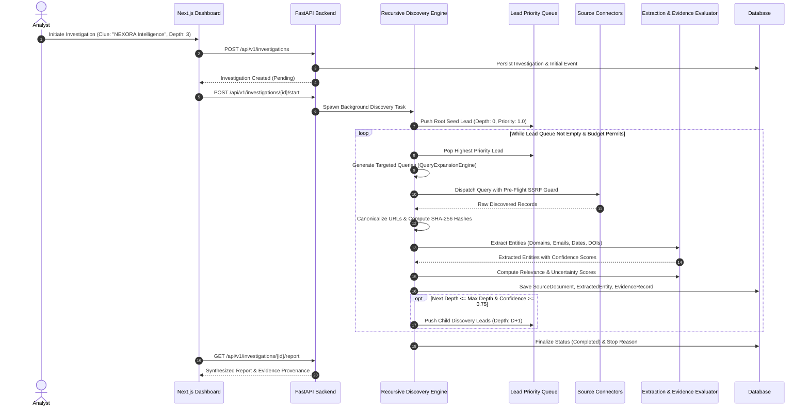

# Data Flow & Recursive Discovery Lifecycle

This document describes the end-to-end data flow when an investigation is executed.

## Discovery Lifecycle Steps

```mermaid
sequenceDiagram
    autonumber
    actor Analyst
    participant Frontend as Next.js Dashboard
    participant API as FastAPI Backend
    participant Engine as Recursive Discovery Engine
    participant Queue as Lead Priority Queue
    participant Connectors as Source Connectors
    participant Extractor as Extraction & Evidence Evaluator
    participant DB as Database

    Analyst->>Frontend: Initiate Investigation (Clue: "NEXORA Intelligence", Depth: 3)
    Frontend->>API: POST /api/v1/investigations
    API->>DB: Persist Investigation & Initial Event
    API-->>Frontend: Investigation Created (Pending)
    
    Frontend->>API: POST /api/v1/investigations/{id}/start
    API->>Engine: Spawn Background Discovery Task
    Engine->>Queue: Push Root Seed Lead (Depth: 0, Priority: 1.0)
    
    loop While Lead Queue Not Empty & Budget Permits
        Engine->>Queue: Pop Highest Priority Lead
        Engine->>Engine: Generate Targeted Queries (QueryExpansionEngine)
        Engine->>Connectors: Dispatch Query with Pre-Flight SSRF Guard
        Connectors-->>Engine: Raw Discovered Records
        Engine->>Engine: Canonicalize URLs & Compute SHA-256 Hashes
        Engine->>Extractor: Extract Entities (Domains, Emails, Dates, DOIs)
        Extractor-->>Engine: Extracted Entities with Confidence Scores
        Engine->>Extractor: Compute Relevance & Uncertainty Scores
        Engine->>DB: Save SourceDocument, ExtractedEntity, EvidenceRecord
        opt Next Depth <= Max Depth & Confidence >= 0.75
            Engine->>Queue: Push Child Discovery Leads (Depth: D+1)
        end
    end
    
    Engine->>DB: Finalize Status (Completed) & Stop Reason
    Frontend->>API: GET /api/v1/investigations/{id}/report
    API-->>Frontend: Synthesized Report & Evidence Provenance
```
